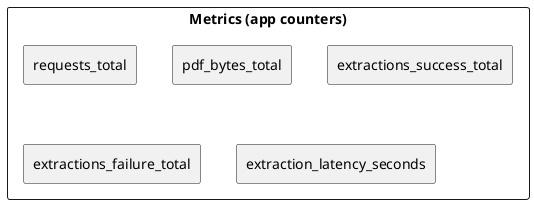

# SPEC-2-Contract Clause Extractor (5–6h Build)

## Background

A lean MVP to demo contract clause extraction in a single afternoon: one FastAPI service handles PDF upload, text extraction, OpenAI-based clause detection (structured JSON), SQLite storage, and retrieval APIs. Includes **Temporal** for orchestration and **MinIO** for object storage, all runnable locally via Docker Compose.

## Requirements

### Must Have

* Single binary/service (FastAPI) with synchronous processing.
* Accept PDF (≤ 25 MB), extract text, call **OpenAI Responses API** with **Structured Outputs** to produce JSON.
* Store raw text + extraction in SQLite; expose endpoints to fetch one or list many.
* Minimal config via env; Dockerized; health endpoint.

### Should Have

* Basic pagination for list endpoint; simple error handling and validation.
* Unit tests for parser and API happy path.

### Won’t Have (MVP)

* OCR for scanned PDFs, queues/orchestration, multi-tenant auth.

## Method

### Database Session Context Manager (for Activities)

```python
# app/database.py (excerpt)
from contextlib import contextmanager
from sqlalchemy import create_engine
from sqlalchemy.orm import sessionmaker

engine = create_engine(settings.database_url, connect_args={"check_same_thread": False})
SessionLocal = sessionmaker(bind=engine, autocommit=False, autoflush=False)

@contextmanager
def get_db():
    db = SessionLocal()
    try:
        yield db
        db.commit()
    except Exception:
        db.rollback()
        raise
    finally:
        db.close()
```

### Architecture Overview (Extended: Temporal + MinIO)

```plantuml
@startuml
skinparam componentStyle rectangle
actor Client as C
rectangle "FastAPI Service" as API {
  [POST /api/extract]
  [GET /api/extractions/{document_id}]
  [GET /api/extractions]
  [GET /health]
}
component "pdfplumber" as PDF
component "OpenAI Responses
(Structured Outputs)" as OAI
component "Temporal Server" as Temporal
component "Worker (Activities)" as Worker
cloud "MinIO (S3-compatible)" as MinIO
DATABASE "SQLite" as DB

C --> API
API --> MinIO : PUT uploads/<doc>.pdf
API --> DB : INSERT document
API --> Temporal : start ExtractionWorkflow(docId)
Temporal --> Worker : schedule activities
Worker --> MinIO : GET uploads/<doc>.pdf
Worker --> PDF : Extract text
Worker --> OAI : Extract clauses (JSON Schema)
Worker --> MinIO : PUT extractions/<doc>.json
Worker --> DB : UPSERT extraction + UPDATE doc status
API --> DB : read results for GETs
@enduml
```

### Temporal Workflow (Simplified)

```python
# worker/workflows.py
from datetime import timedelta
from temporalio import workflow

with workflow.unsafe.imports_passed_through():
    from worker.activities import parse_pdf, llm_extract, store_results

@workflow.defn
class ExtractionWorkflow:
    @workflow.run
    async def run(self, document_id: str) -> dict:
        parsed = await workflow.execute_activity(
            parse_pdf,
            document_id,
            start_to_close_timeout=timedelta(seconds=60),
            retry_policy=workflow.RetryPolicy(maximum_attempts=3),
        )
        extracted = await workflow.execute_activity(
            llm_extract,
            args=[document_id, parsed["text"]],
            start_to_close_timeout=timedelta(seconds=120),
            retry_policy=workflow.RetryPolicy(maximum_attempts=2),
        )
        await workflow.execute_activity(
            store_results,
            args=[document_id, extracted],
            start_to_close_timeout=timedelta(seconds=30),
        )
        return {"status": "completed", "document_id": document_id}
```

### Activities (OpenAI + MinIO)

```python
# worker/activities.py
from temporalio import activity
from app.storage import storage_client
from app.database import get_db, Document, Extraction
from worker.pdf_parser import extract_text_and_pages
from worker.llm_extractor import extract_clauses
import json, os

@activity.defn
async def parse_pdf(document_id: str) -> dict:
    pdf_bytes = storage_client.get_object("uploads", f"{document_id}.pdf")
    text, pages = extract_text_and_pages(pdf_bytes)
    with get_db() as db:
        doc = db.query(Document).filter(Document.id == document_id).first()
        doc.raw_text = text; doc.page_count = pages; doc.status = "processing"; db.commit()
    return {"text": text, "page_count": pages}

@activity.defn
async def llm_extract(document_id: str, text: str) -> dict:
    result = await extract_clauses(text)  # OpenAI Responses + Structured Outputs
    return result.model_dump()

@activity.defn
async def store_results(document_id: str, data: dict) -> None:
    storage_client.put_object("extractions", f"{document_id}.json", json.dumps(data).encode())
    with get_db() as db:
        db.add(Extraction(document_id=document_id, model_used=os.getenv("MODEL_NAME","gpt-5-mini"), clauses=data, metadata=data))
        doc = db.query(Document).filter(Document.id == document_id).first()
        doc.status = "completed"; db.commit()
```

### Updated API Flow (start workflow + MinIO)

```python
# app/main.py (essential changes)
from temporalio.client import Client as TemporalClient
from worker.workflows import ExtractionWorkflow

@app.on_event("startup")
async def start_temporal():
    app.state.temporal = await TemporalClient.connect(settings.temporal_address)

@app.post("/api/extract")
async def extract(file: UploadFile = File(...)):
    # ... validate, generate document_id
    storage_client.put_object("uploads", f"{document_id}.pdf", await file.read())
    with get_db() as db: db.add(Document(...)); db.commit()
    await app.state.temporal.start_workflow(
        ExtractionWorkflow.run,
        document_id,
        id=f"extraction-{document_id}",
        task_queue="extraction-queue",
    )
    return {"id": document_id, "document_id": document_id, "status": "pending", ...}
```

### Buckets & Paths

* `uploads/<document_id>.pdf`
* `extractions/<document_id>.json`

### Development Approach: Small, Testable Chunks

Each chunk ships in ≤ 60–90 minutes with full tests and coverage ≥ 90% (line/branch). Merge only when green.

1. **Foundations** — project scaffold, settings, health route.
2. **DB Layer** — SQLAlchemy models + CRUD helpers (no endpoints yet).
3. **PDF Parser** — pure function `extract_text_and_pages` with unit tests and fixtures.
4. **LLM Adapter** — OpenAI client wrapper with strict schema + mocked tests.
5. **POST /api/extract** — endpoint using parser + adapter; tests incl. size/type validation.
6. **GET endpoints** — retrieval + pagination, including DB queries.
7. **Error/Observability** — exception mapping, timing metrics, logging.
8. **Docs & Demo** — README, sample scripts.

Each step: commit → run `make test` → inspect `htmlcov/` → PR.

### Tooling & Commands

* **pytest** + **pytest-cov** with **coverage fail-under = 95%** (HTML).
* **pytest-asyncio** for async activity tests, **pytest-docker** (optional) for spinning up Temporal/MinIO.
* **unittest.mock** /**pytest-mock** to isolate OpenAI + MinIO.

```ini
# pyproject.toml (testing & coverage)
[tool.pytest.ini_options]
addopts = "-q --cov=app --cov=worker --cov-branch --cov-report=term-missing --cov-report=html"
testpaths = ["tests"]
markers = [
  "integration: tests requiring Temporal/MinIO services",
]

[tool.coverage.run]
source = ["app","worker"]
branch = true
omit = ["**/__init__.py", "**/run_worker.py"]

[tool.coverage.report]
fail_under = 95
show_missing = true
skip_covered = false

[tool.coverage.html]
directory = "htmlcov"
```ini
# pyproject.toml (testing & coverage)
[tool.pytest.ini_options]
addopts = "-q --cov=app --cov-branch --cov-report=term-missing --cov-report=html"
testpaths = ["tests"]
filterwarnings = ["ignore::DeprecationWarning"]

[tool.coverage.run]
source = ["app"]
branch = true
omit = ["app/__init__.py"]

[tool.coverage.report]
fail_under = 95
show_missing = true
skip_covered = false

[tool.coverage.html]
directory = "htmlcov"
```

```makefile
# Makefile
.PHONY: test lint cov

install:
	pip install -r requirements.txt

lint:
	ruff check .

test:
	pytest

cov:
	pytest --cov && python -m webbrowser -t htmlcov/index.html
```

### Unit Tests (expanded)

**Sample PDFs**

* `sample_contracts/simple.pdf` — 1–2 pages with a few headings and words (for happy path).
* `sample_contracts/empty.pdf` — blank page (graceful parse path).

*Optional generator (if you’d rather build than commit binaries):*

```python
# tools/gen_pdfs.py
from reportlab.pdfgen import canvas
from reportlab.lib.pagesizes import letter

for name, lines in {
    "sample_contracts/simple.pdf": ["Master Services Agreement", "Governing Law: California", "Either party may terminate..."],
    "sample_contracts/empty.pdf": []
}.items():
    c = canvas.Canvas(name, pagesize=letter)
    y = 750
    for line in lines:
        c.drawString(72, y, line)
        y -= 18
    c.showPage(); c.save()
print("Generated sample PDFs.")
```

(Add `reportlab` to `requirements-dev.txt` if you use the generator.)

### Unit Tests (expanded)

 **Test strategy** : isolate layers, mock I/O & network, and drive all branches. Use in-memory SQLite and FastAPI dependency overrides. Sample valid PDFs live in `sample_contracts/`.

**`tests/conftest.py`** — app + DB fixtures, dependency overrides

```python
import os, tempfile, pathlib
import pytest
from fastapi.testclient import TestClient
from sqlalchemy import create_engine
from sqlalchemy.orm import sessionmaker
from app.main import app
from app.database import Base, get_db

@pytest.fixture(scope="session")
def tmp_db_url():
    fd, path = tempfile.mkstemp(prefix="contracts_", suffix=".db")
    os.close(fd)
    yield f"sqlite:///{path}"
    try:
        pathlib.Path(path).unlink(missing_ok=True)
    except Exception:
        pass

@pytest.fixture(scope="session")
def engine(tmp_db_url):
    eng = create_engine(tmp_db_url, connect_args={"check_same_thread": False})
    Base.metadata.create_all(eng)
    return eng

@pytest.fixture()
def db_session(engine):
    TestingSessionLocal = sessionmaker(bind=engine)
    session = TestingSessionLocal()
    try:
        yield session
    finally:
        session.close()

@pytest.fixture()
def client(db_session, monkeypatch):
    def _get_db_override():
        try:
            yield db_session
        finally:
            pass
    app.dependency_overrides[get_db] = _get_db_override
    return TestClient(app)
```

**1) PDF Parser (real PDF fixture)**

```python
# tests/test_pdf_parser.py
import pathlib
from app.pdf_parser import extract_text_and_pages

def test_extract_text_and_pages_sample_pdf():
    sample = pathlib.Path("sample_contracts/simple.pdf").read_bytes()
    text, pages = extract_text_and_pages(sample)
    assert pages >= 1
    assert "Agreement" in text or len(text) > 20

def test_extract_empty_pdf_graceful():
    empty_pdf = pathlib.Path("sample_contracts/empty.pdf").read_bytes()
    text, pages = extract_text_and_pages(empty_pdf)
    assert pages >= 1
    assert isinstance(text, str)
```

**2) LLM Adapter — success & malformed JSON**

```python
# tests/test_llm_extractor.py
import pytest
from unittest.mock import patch
from app.llm_extractor import extract_clauses
from app.models import ExtractionResult

@pytest.mark.asyncio
async def test_extract_clauses_success():
    ok_json = ExtractionResult(
        parties={"party_one":"A","party_two":"B","additional_parties":[]},
        dates={"effective_date":"2025-01-01","termination_date":None,"term_length":None},
        clauses={"governing_law":"CA"},
        confidence=0.9
    ).model_dump_json()

    class Fake:
        output = [type("x", (), {"type":"output_text","text": ok_json})()]

    with patch("app.llm_extractor.client.responses.create", return_value=Fake()):
        res = await extract_clauses("abc")
        assert isinstance(res, ExtractionResult)
        assert res.clauses.governing_law == "CA"

@pytest.mark.asyncio
async def test_extract_clauses_malformed_json_raises():
    class Fake:
        output = [type("x", (), {"type":"output_text","text": "{not json}"})()]

    with patch("app.llm_extractor.client.responses.create", return_value=Fake()):
        with pytest.raises(Exception):
            await extract_clauses("abc")
```

**3) API — happy path & failures**

```python
# tests/test_api_extract.py
import io
from uuid import UUID

def test_extract_success(client, monkeypatch):
    # Mock LLM result
    async def fake_extract(text: str):
        from app.models import ExtractionResult, Parties, ContractDates, Clauses
        return ExtractionResult(
            parties=Parties(party_one="Acme", party_two="Beta", additional_parties=[]),
            dates=ContractDates(effective_date="2025-01-01"),
            clauses=Clauses(governing_law="CA", termination="Either party may..."),
            confidence=0.88
        )
    monkeypatch.setattr("app.main.extract_clauses", fake_extract)

    # Use a minimal valid pdf from fixtures
    data = open("sample_contracts/simple.pdf", "rb").read()
    files = {"file": ("msa.pdf", io.BytesIO(data), "application/pdf")}

    r = client.post("/api/extract", files=files)
    assert r.status_code == 200
    body = r.json()
    UUID(body["document_id"])  # valid uuid
    assert body["status"] == "completed"
    assert body["extraction"]["clauses"]["governing_law"] == "CA"

def test_reject_non_pdf(client):
    r = client.post("/api/extract", files={"file": ("a.txt", b"hello", "text/plain")})
    assert r.status_code == 400

def test_reject_oversize(client):
    big = b"%PDF-1.4
" + b"x" * (26 * 1024 * 1024)
    r = client.post("/api/extract", files={"file": ("big.pdf", big, "application/pdf")})
    assert r.status_code == 413

def test_llm_failure_marks_failed(client, monkeypatch):
    async def boom(text: str):
        raise RuntimeError("openai down")
    monkeypatch.setattr("app.main.extract_clauses", boom)

    pdf = open("sample_contracts/simple.pdf", "rb").read()
    r = client.post("/api/extract", files={"file": ("x.pdf", io.BytesIO(pdf), "application/pdf")})
    assert r.status_code == 500
    # Optionally query GET endpoint to verify status=failed if available
```

**4) GET Endpoints & Pagination**

```python
# tests/test_api_get.py
from uuid import uuid4
from app.database import Document, Extraction

def seed_doc(db, status="completed"):
    d = Document(id=str(uuid4()), filename="a.pdf", file_size=10, page_count=1, status=status, raw_text="hi")
    e = Extraction(id=str(uuid4()), document_id=d.id, model_used="gpt-5-mini", clauses="{}", metadata="{}")
    db.add(d); db.add(e); db.commit()
    return d.id

def test_get_by_document_id(client, db_session):
    doc_id = seed_doc(db_session)
    r = client.get(f"/api/extractions/{doc_id}")
    assert r.status_code == 200
    assert r.json()["document_id"] == doc_id

def test_list_pagination(client, db_session):
    for _ in range(15): seed_doc(db_session)
    r = client.get("/api/extractions?page=2&page_size=5")
    assert r.status_code == 200
    body = r.json()
    assert body["page"] == 2
    assert body["page_size"] == 5
    assert len(body["items"]) == 5
```

**5) Branch Coverage: error mapping & schema validation**

```python
# tests/test_error_paths.py
import io, pytest
from app.main import app

def test_schema_validation_error_propagates(client, monkeypatch):
    async def bad(text: str):
        from app.models import ExtractionResult
        # Return object with missing required fields to force validation error
        return ExtractionResult.model_validate({"confidence": 0.5, "parties": {}, "dates": {}, "clauses": {}})
    monkeypatch.setattr("app.main.extract_clauses", bad)

    pdf = open("sample_contracts/simple.pdf", "rb").read()
    r = client.post("/api/extract", files={"file": ("x.pdf", io.BytesIO(pdf), "application/pdf")})
    assert r.status_code in (200, 500)  # depending on how main handles
```

**Run locally**

```bash
pytest -q --cov=app --cov-branch --cov-report=term-missing --cov-report=html
# open htmlcov/index.html
```

```yaml
# .github/workflows/ci.yml
name: ci
on: [push, pull_request]
jobs:
  test:
    runs-on: ubuntu-latest
    steps:
      - uses: actions/checkout@v4
      - uses: actions/setup-python@v5
        with: { python-version: '3.11' }
      - run: pip install -r requirements.txt
      - run: pytest -q --cov=app --cov-branch --cov-report=term-missing --cov-report=xml --cov-report=html
      - uses: actions/upload-artifact@v4
        with:
          name: coverage-html
          path: htmlcov
```

### Coverage Review

* HTML report generated at `htmlcov/index.html` (local) and uploaded as CI artifact.
* **Threshold** : fail build if coverage < 90% (config in `pyproject.toml`).

1. **Scaffold** repo per tree; add `requirements.txt` (`fastapi`, `uvicorn`, `sqlalchemy`, `pydantic-settings`, `openai`, `pdfplumber`).
2. **DB** : define SQLAlchemy models for `documents`, `extractions`; init SQLite if missing.
3. **Parsing** : implement `extract_text_and_pages`.
4. **LLM** : implement `extract_clauses` using Responses + Structured Outputs.
5. **API** : wire endpoints; return `ExtractionResponse` payloads.
6. **Tests** : minimal test for `/health` and `/api/extract` using a sample PDF.
7. **Run** : `docker compose up --build`; `curl -F file=@sample.pdf localhost:8000/api/extract`.

## Milestones

* **H1 (60–90m)** : Project setup, Docker, DB models, health route.
* **H2 (60m)** : PDF parsing + POST `/api/extract` happy path.
* **H3 (45m)** : OpenAI Structured Outputs integration + schema plumbing.
* **H4 (30m)** : GET endpoints + pagination.
* **H5 (20m)** : Tests, README, demo script.

## Gathering Results

### Operational Dashboards (suggested)



**How to verify MVP**

* Run 3–5 sample PDFs; confirm `status=completed`, responses match schema.
* Sanity-check key clauses: governing law, termination, payment terms.
* Measure latency: ensure P50 < 40s, P95 < 90s on your laptop.

**Quality Checklist**

* [ ] Health endpoint returns ok
* [ ] Non-PDF rejected
* [ ] Oversize file rejected
* [ ] Extraction JSON passes schema validation
* [ ] Failure path marks document as `failed` with error message

## Need Professional Help in Developing Your Architecture?

Please contact me at [sammuti.com](https://sammuti.com/) :)

Please contact me at [sammuti.com](https://sammuti.com/) :)

## Testing (Temporal + MinIO)

### Unit Tests (extended)

**Storage Wrapper (MinIO)** — mock S3 client methods

```python
# tests/test_storage.py
from unittest.mock import MagicMock
from app.storage import StorageClient

def test_put_get_roundtrip(monkeypatch):
    sc = StorageClient()
    fake = MagicMock()
    monkeypatch.setattr(sc, "client", fake)
    sc.put_object("uploads", "x.pdf", b"abc")
    fake.put_object.assert_called()
    fake.get_object.return_value.read.return_value = b"abc"
    assert sc.get_object("uploads","x.pdf") == b"abc"
```

**Activities** — exercise branches with mocks

```python
# tests/test_activities.py
import asyncio, types, pytest
from worker.activities import parse_pdf, llm_extract, store_results

@pytest.mark.asyncio
async def test_parse_pdf_reads_from_minio(monkeypatch):
    monkeypatch.setattr("worker.activities.storage_client.get_object", lambda b,k: b"%PDF-1.4
...")
    monkeypatch.setattr("worker.activities.extract_text_and_pages", lambda d: ("Hello", 1))
    class DB:  # minimal context manager
        def __enter__(self): return self
        def __exit__(self,*a): pass
        def query(self,_): return types.SimpleNamespace(get=lambda i: types.SimpleNamespace(id=i))
        def commit(self): pass
    monkeypatch.setattr("worker.activities.get_db", lambda: DB())
    out = await parse_pdf("doc-1")
    assert out == {"text":"Hello","page_count":1}

@pytest.mark.asyncio
async def test_llm_extract_uses_openai(monkeypatch):
    f = asyncio.Future(); f.set_result(types.SimpleNamespace(model_dump=lambda: {"clauses":{"governing_law":"CA"}}))
    monkeypatch.setattr("worker.activities.extract_clauses", lambda t: f)
    res = await llm_extract("doc-1","text")
    assert res["clauses"]["governing_law"] == "CA"

@pytest.mark.asyncio
async def test_store_results_writes_minio_and_db(monkeypatch):
    called = {}
    monkeypatch.setattr("worker.activities.storage_client.put_object", lambda b,k,d: called.setdefault("ok",True))
    class DB:
        def __enter__(self): return self
        def __exit__(self,*a): pass
        def add(self,_): pass
        def query(self,_): return types.SimpleNamespace(get=lambda i: types.SimpleNamespace(id=i))
        def commit(self): pass
    monkeypatch.setattr("worker.activities.get_db", lambda: DB())
    await store_results("doc-1", {"k":"v"})
    assert called.get("ok")
```

**Workflow (integration)** — behind `-m integration`

```python
# tests/test_workflow_integration.py
import os, pytest
pytestmark = pytest.mark.integration

@pytest.mark.asyncio
async def test_workflow_happy_path():
    if os.getenv("INTEGRATION") != "1":
        pytest.skip("integration off")
    from temporalio.client import Client
    from worker.workflows import ExtractionWorkflow
    from app.storage import storage_client
    storage_client.put_object("uploads","it.pdf", open("sample_contracts/simple.pdf","rb").read())
    client = await Client.connect("temporal:7233")
    handle = await client.start_workflow(ExtractionWorkflow.run, "it", id="extraction-it", task_queue="extraction-queue")
    res = await handle.result()
    assert res["status"] == "completed"
```

### Coverage

* Enforce **95%** line/branch across `app/` and `worker/`.
* Generate HTML at `htmlcov/index.html`; upload as CI artifact.

## CI (GitHub Actions)

```yaml
name: ci
on: [push, pull_request]
jobs:
  unit:
    runs-on: ubuntu-latest
    steps:
      - uses: actions/checkout@v4
      - uses: actions/setup-python@v5
        with: { python-version: '3.11' }
      - run: pip install -r requirements.txt
      - run: pytest -q --cov=app --cov=worker --cov-branch --cov-report=term-missing --cov-report=xml --cov-report=html
      - uses: actions/upload-artifact@v4
        with:
          name: coverage-html
          path: htmlcov
  integration:
    if: github.event_name == 'push' && contains(github.ref, 'main')
    runs-on: ubuntu-latest
    services:
      temporal:
        image: temporalio/auto-setup:1.24
        ports: ["7233:7233"]
        options: >-
          --health-cmd="tctl --address localhost:7233 cluster health" --health-interval=10s --health-timeout=5s --health-retries=12
      minio:
        image: minio/minio:latest
        env:
          MINIO_ROOT_USER: minioadmin
          MINIO_ROOT_PASSWORD: minioadmin
        ports: ["9000:9000"]
        command: server /data
    env:
      INTEGRATION: "1"
    steps:
      - uses: actions/checkout@v4
      - uses: actions/setup-python@v5
        with: { python-version: '3.11' }
      - run: pip install -r requirements.txt
      - run: pytest -q -m integration --maxfail=1 --disable-warnings
```

## Ticket Breakdown (Executable, Test-First)

> Definition of Done (applies to all tickets):
>
> * Unit tests with **≥95%** line & branch coverage (HTML report in `htmlcov/`).
> * Code linted; type hints where practical; docs updated.
> * All CI jobs green.

**T-01: Repo Scaffold & Tooling**
**Type:** Infra
**Desc:** Initialize repo, basic structure (`app/`, `worker/`, `tests/`, `sample_contracts/`, `tools/`), `pyproject.toml` with pytest/coverage config (fail-under 95), Makefile, pre-commit hooks.
**AC:** `pytest` runs, `make cov` opens HTML, `ruff` passes.
**Est:** 0.5h
**Deps:** —

**T-02: Docker Compose (API, Worker, Temporal, MinIO, SQLite)**
**Type:** Infra
**Desc:** Compose stack with ports (`8000`, `7233`, `8233`, `9000`, `9001`), volumes, env wiring.
**AC:** `docker compose up` brings all services healthy; Temporal Web accessible; MinIO console accessible.
**Tests:** container healthchecks verified; smoke `curl /health`.
**Est:** 0.75h
**Deps:** T-01

**T-03: Database Layer & Context Manager**
**Type:** Backend
**Desc:** SQLAlchemy models for `documents`, `extractions`; `get_db()` context manager (commit/rollback/close). Alembic optional later.
**AC:** Tables created on startup; CRUD unit tests using in-memory/temporary SQLite.
**Est:** 0.5h
**Deps:** T-01

**T-04: MinIO Storage Wrapper**
**Type:** Backend
**Desc:** `StorageClient` with `put_object/get_object`, bucket ensure (`uploads`, `extractions`).
**AC:** Unit tests mock MinIO client; round-trip tested.
**Est:** 0.5h
**Deps:** T-02

**T-05: PDF Parsing Module**
**Type:** Backend
**Desc:** `extract_text_and_pages(bytes) -> (text, pages)` using `pdfplumber`.
**AC:** Parser unit tests pass using `sample_contracts/simple.pdf` and `empty.pdf` (or generator script).
**Est:** 0.5h
**Deps:** T-01

**T-06: OpenAI LLM Adapter (Structured Outputs)**
**Type:** Backend
**Desc:** Wrapper `extract_clauses(text) -> ExtractionResult` using Responses API with JSON Schema (`gpt-5-mini` default, switchable to `gpt-5.2`).
**AC:** Unit tests mock OpenAI; success + malformed JSON error paths covered.
**Est:** 0.75h
**Deps:** T-01

**T-07: Temporal Activities**
**Type:** Worker
**Desc:** Implement `parse_pdf`, `llm_extract`, `store_results` activities using storage, parser, LLM, and DB. Replace `db.query().get()` with `filter().first()`.
**AC:** Unit tests with mocks for MinIO/OpenAI/DB; status moves `pending→processing→completed`.
**Est:** 0.75h
**Deps:** T-03, T-04, T-05, T-06

**T-08: Temporal Workflow**
**Type:** Worker
**Desc:** `ExtractionWorkflow` chaining activities, timeouts, retry policies, return payload.
**AC:** Local integration test (optional) behind marker `-m integration` starts workflow and asserts completed.
**Est:** 0.5h
**Deps:** T-07, T-02

**T-09: API - Startup & Health**
**Type:** API
**Desc:** FastAPI app, `GET /health`, Temporal client connect on startup.
**AC:** Health returns `{status:'ok'}`; startup doesn’t block tests (dependency override for Temporal in unit tests).
**Est:** 0.25h
**Deps:** T-02

**T-10: API - POST /api/extract (Start Workflow)**
**Type:** API
**Desc:** Validate PDF (type/size), store to MinIO, create `documents` row, start workflow on `extraction-queue`.
**AC:** Unit tests (mock Temporal + LLM) for happy path, non-PDF, oversize; DB reflects `pending`.
**Est:** 0.75h
**Deps:** T-03, T-04, T-09

**T-11: API - GET /api/extractions/{document_id}**
**Type:** API
**Desc:** Read combined doc + latest extraction.
**AC:** Unit tests with DB fixtures.
**Est:** 0.25h
**Deps:** T-03

**T-12: API - GET /api/extractions (Pagination)**
**Type:** API
**Desc:** Paginated list (`page`, `page_size`), default 10, max 100.
**AC:** Tests for paging math and bounds.
**Est:** 0.25h
**Deps:** T-03

**T-13: Workflow Integration Test**
**Type:** QA/Integration
**Desc:** Under `-m integration`, seed PDF in MinIO, start workflow, await result; requires docker services.
**AC:** Green integration job in CI on `main`; local run documented.
**Est:** 0.5h
**Deps:** T-08, T-02

**T-14: CI Pipeline**
**Type:** DevEx
**Desc:** GitHub Actions: unit job (coverage HTML artifact), optional integration job with Temporal/MinIO services and `INTEGRATION=1`.
**AC:** PRs run unit workflow; main triggers integration; coverage ≥95% gate enforced.
**Est:** 0.5h
**Deps:** T-01, T-13

**T-15: Docs & Demo**
**Type:** Docs
**Desc:** README with run instructions, PlantUML diagrams, API reference, sample `curl` calls; `tools/gen_pdfs.py` (optional).
**AC:** Fenced commands copy-pasteable; diagrams render; links to Temporal Web and MinIO console.
**Est:** 0.5h
**Deps:** T-02..T-12

**T-16: Hardening & Error Paths**
**Type:** Backend
**Desc:** Error mapping (HTTP 4xx/5xx), log redaction, input truncation for LLM, retries/backoff on 429/5xx.
**AC:** Branch tests cover failure paths; logs contain no PII; limits enforced.
**Est:** 0.5h
**Deps:** T-06, T-10

### Suggested Execution Order

T-01 → T-02 → T-03 → T-04 → T-05 → T-06 → T-07 → T-08 → T-09 → T-10 → T-11 → T-12 → T-16 → T-13 → T-14 → T-15

### Parallelizable (if 2+ engineers)

* Eng A: T-03, T-04, T-05, T-07
* Eng B: T-06, T-09, T-10, T-11, T-12
* Pair: T-08, T-13, T-14, T-15
